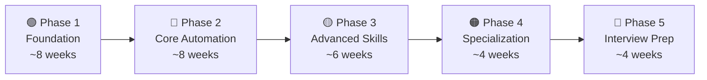

# 🎯 Senior QA/SDET Specialist — Complete Master Plan

> **Teacher:** Antigravity AI  
> **Student:** Hariom  
> **Goal:** Senior QA/SDET Specialist role crack karna — har skill ko phase-wise master karna  
> **Estimated Duration:** ~6-8 months (daily 3-4 hours dedication ke saath)  
> **Start Date:** August 2026

---

## 📋 Plan Overview

Yeh plan **5 Phases** mein divided hai. Har phase mein theory + hands-on projects + mini-assessments honge. Phase 1 strong hone ke baad hi Phase 2 mein jaana hai — **shortcut nahi lena**.



---

## 🟢 PHASE 1 — Foundation (Week 1-8)

> **Goal:** JS/TS strong karna, Git master karna, SQL basics, testing fundamentals samajhna

### Module 1.1 — JavaScript Deep Dive (Week 1-3)

| Topic | Kya Seekhna Hai | Practice |
|-------|-----------------|----------|
| **JS Basics Refresh** | Variables (let/const/var), data types, operators, conditionals, loops | 20+ small coding exercises |
| **Functions & Scope** | Function declarations, expressions, arrow functions, closures, hoisting, IIFE | Closure-based counter, memoization function likhna |
| **ES6+ Features** | Destructuring, spread/rest, template literals, default params, optional chaining, nullish coalescing | Existing code ko ES6+ mein refactor karna |
| **Arrays & Objects** | map, filter, reduce, find, some, every, Object.keys/values/entries, deep copy vs shallow copy | Data transformation exercises (real API response manipulate karna) |
| **Async Programming** | Callbacks → Promises → async/await, Promise.all/allSettled/race, error handling with try/catch | Sequential & parallel API calls likhna, callback hell ko async/await mein convert karna |
| **Event Loop** | Call stack, task queue, microtask queue, setTimeout/setInterval, process.nextTick | Visual diagrams banana, output predict karne wale exercises |
| **Error Handling** | try/catch/finally, custom Error classes, error propagation, global error handlers | Custom `TestError`, `APIError`, `ValidationError` classes banana |
| **Node.js Basics** | CommonJS vs ES Modules, npm/pnpm, package.json, scripts, file system (fs), path module, process, streams basics | CLI tool banana jo files read/write kare |

#### 📁 Practice Project — Phase 1.1
```
Project: "Data Processor CLI"
- Node.js CLI tool banao jo CSV/JSON files read kare
- Data ko transform kare (filter, map, aggregate)
- Output file mein likhay
- Async file operations use karo
- Custom error classes use karo
- ES6+ features extensively use karo
```

---

### Module 1.2 — TypeScript Mastery (Week 3-5)

| Topic | Kya Seekhna Hai | Practice |
|-------|-----------------|----------|
| **Basic Types** | string, number, boolean, arrays, tuples, enums, any vs unknown vs never | JS code ko TS mein migrate karna |
| **Interfaces & Type Aliases** | Interface declaration, extending, implementing, type vs interface differences | API response types define karna |
| **Union & Intersection Types** | Union (`\|`), Intersection (`&`), discriminated unions, literal types | Type-safe event system banana |
| **Generics** | Generic functions, classes, interfaces, constraints (`extends`), default types | Generic `ApiResponse<T>`, `Repository<T>` banana |
| **Utility Types** | `Partial<T>`, `Pick<T,K>`, `Omit<T,K>`, `Record<K,V>`, `Required<T>`, `Readonly<T>`, `ReturnType<T>` | Test data factories mein utility types use karna |
| **Type Narrowing & Guards** | typeof, instanceof, `in` operator, custom type guards (`is` keyword), assertion functions | Runtime type validation functions likhna |
| **Strict Mode & tsconfig** | `strict`, `strictNullChecks`, `noImplicitAny`, `esModuleInterop`, path aliases, target/module options | Production-ready tsconfig.json configure karna |
| **Decorators** | Class decorators, method decorators, parameter decorators, decorator factories | Custom `@step`, `@retry`, `@log` decorators banana (test framework ke liye) |
| **Advanced Patterns** | Mapped types, conditional types, template literal types, `infer` keyword | Type-safe test configuration system banana |

#### 📁 Practice Project — Phase 1.2
```
Project: "Type-Safe Test Utilities Library"
- Generic test data factory banana (faker.js ke saath)
- Type-safe configuration loader
- Custom decorators: @retry, @timeout, @step
- Publish as npm package (private)
- Full strict mode, zero 'any' usage
```

---

### Module 1.3 — Git & Version Control (Week 5-6)

| Topic | Kya Seekhna Hai | Practice |
|-------|-----------------|----------|
| **Git Fundamentals** | init, add, commit, status, log, diff, stash | Daily commits practice |
| **Branching** | Branch create/switch/merge, feature branch workflow, naming conventions | Feature branch workflow simulate karna |
| **Advanced Git** | Rebase (interactive), cherry-pick, bisect, reflog, reset (soft/mixed/hard) | Conflict resolution exercises, rebase practice |
| **Collaboration** | Pull requests, code reviews, merge strategies (squash, rebase, merge commit) | GitHub par PR create, review, merge karna |
| **Git Hooks** | pre-commit, commit-msg, pre-push hooks, husky + lint-staged setup | Auto-lint, test run on commit setup karna |
| **.gitignore & Configs** | Patterns, global gitignore, .gitattributes | Project-specific gitignore banana |

---

### Module 1.4 — SQL & Database Basics (Week 6-8)

| Topic | Kya Seekhna Hai | Practice |
|-------|-----------------|----------|
| **SQL Fundamentals** | SELECT, WHERE, ORDER BY, GROUP BY, HAVING, LIMIT | 30+ query exercises |
| **Joins** | INNER, LEFT, RIGHT, FULL OUTER, CROSS, self joins | Multi-table query challenges |
| **Subqueries** | Scalar, column, table subqueries, correlated subqueries, EXISTS | Complex data retrieval exercises |
| **Window Functions** | ROW_NUMBER, RANK, DENSE_RANK, LAG, LEAD, SUM/AVG OVER() | Analytics queries likhna |
| **Indexes & Optimization** | B-tree index, covering index, EXPLAIN plan, query optimization basics | Slow queries optimize karna |
| **PostgreSQL Specifics** | JSON/JSONB, CTEs, UPSERT, date functions, string functions | PostgreSQL setup aur practice |
| **NoSQL — MongoDB** | Documents, collections, CRUD, aggregation pipeline, indexing | MongoDB Atlas free tier use karna |
| **Database in Testing** | Test data setup/teardown, transactions for isolation, fixtures, seeding strategies | Test database cleanup scripts banana |

#### 📁 Practice Project — Phase 1.3
```
Project: "Test Data Manager"
- PostgreSQL + MongoDB dono mein CRUD operations
- Seed scripts banana (test data populate karna)
- Cleanup scripts (test ke baad data clean karna)
- Transaction-based isolation implement karna
- Query performance analyze karna (EXPLAIN)
```

---

### ✅ Phase 1 Completion Checklist
- [x] JS mein async code confidently likh sakte ho
- [x] TS mein generics aur utility types samajh aur use kar sakte ho
- [x] Git rebase, cherry-pick, conflict resolution kar sakte ho
- [x] SQL mein joins, subqueries, window functions likh sakte ho
- [x] 3 practice projects complete hain with unit tests & clean code

---

## 🔵 PHASE 2 — Core Test Automation (Week 9-16)

> **Goal:** Playwright master karna, API testing, BDD framework, CI/CD pipeline banana

### Module 2.1 — Playwright Master Class (Week 9-12)

| Topic | Kya Seekhna Hai | Practice |
|-------|-----------------|----------|
| **Setup & Basics** | Installation, first test, locators, assertions, test runner config | 10+ basic test scenarios |
| **Locators Deep Dive** | getByRole, getByText, getByTestId, CSS/XPath (backup), locator chaining, filtering | Complex page elements locate karna |
| **Actions & Interactions** | Click, fill, select, hover, drag-drop, file upload/download, keyboard/mouse events | E-commerce site par full user flow automate karna |
| **Assertions** | expect(), toBeVisible, toHaveText, toHaveURL, soft assertions, custom matchers | Comprehensive assertion library banana |
| **Page Object Model** | POM design, base page class, component objects, fixtures integration | Full POM framework banana for a real website |
| **Fixtures & Hooks** | Test fixtures, worker fixtures, beforeAll/afterAll, beforeEach/afterEach, fixture dependencies | Custom fixtures: authenticated user, test data, API client |
| **API Testing with Playwright** | APIRequestContext, GET/POST/PUT/DELETE, request/response interception | Full API test suite banana |
| **Network Interception** | Route mocking, request modification, response stubbing, network conditions | Mock API responses for UI tests |
| **Visual Testing** | Screenshot comparison, toHaveScreenshot(), snapshot testing config | Visual regression suite setup karna |
| **Parallel & Sharding** | Worker configuration, test isolation, sharding across machines, retry strategies | CI mein parallel execution configure karna |
| **Reporting** | Built-in HTML reporter, Allure integration, custom reporters, trace viewer | Allure reports setup karna |
| **Advanced** | Browser contexts, multiple pages, iframes, shadow DOM, web components, mobile emulation | Complex scenarios automate karna |
| **Debugging** | Trace viewer, headed mode, slowMo, pause(), Playwright Inspector | Flaky test debug karna |

#### 📁 Practice Project — Phase 2.1
```
Project: "E2E Test Framework — Real-World App"
Target: Kisi open-source web app par (e.g., SauceDemo, OrangeHRM, Conduit)
- Full Page Object Model framework
- 50+ test cases: login, CRUD, search, filters, forms
- Custom fixtures: auth, test data, API helpers
- Visual regression tests
- Allure reporting
- Parallel execution configured
- CI-ready (GitHub Actions)
```

---

### Module 2.2 — API Testing Mastery (Week 12-14)

| Topic | Kya Seekhna Hai | Practice |
|-------|-----------------|----------|
| **HTTP Deep Dive** | Methods (GET/POST/PUT/PATCH/DELETE), status codes (2xx/3xx/4xx/5xx), headers, content types | HTTP fundamentals quiz |
| **Postman/Newman** | Collections, environments, variables, pre-request scripts, tests tab, Newman CLI, data-driven testing | Full API collection banana with tests |
| **Supertest (Node.js)** | Setup, GET/POST assertions, auth headers, file upload, chaining requests | Express app test karna |
| **Schema Validation** | JSON Schema, Zod validation, AJV library, schema generation | API response schema validation suite |
| **Auth Flows** | OAuth 2.0, JWT tokens, API keys, bearer tokens, refresh token flow | Auth flow automate karna |
| **GraphQL Testing** | Queries, mutations, subscriptions, schema introspection, variable passing | GraphQL API test suite |
| **Contract Testing** | Pact.js setup, consumer-driven contracts, provider verification, Pact Broker | Consumer-provider contract tests |
| **Mock Servers** | MSW (Mock Service Worker), Nock, json-server, WireMock | Isolated tests with mock servers |
| **API Framework Design** | Base client class, request/response interceptors, retry logic, logging, environment config | Custom API testing framework banana |

#### 📁 Practice Project — Phase 2.2
```
Project: "API Test Framework"
- Custom API client with retry, logging, auth handling
- RESTful API complete test suite (CRUD + edge cases)
- JSON Schema validation for all endpoints
- Contract tests with Pact.js
- Newman integration for CI
- Mock server setup for isolated testing
- GraphQL test suite (bonus)
```

---

### Module 2.3 — BDD with Cucumber (Week 14-15)

| Topic | Kya Seekhna Hai | Practice |
|-------|-----------------|----------|
| **Gherkin Syntax** | Feature, Scenario, Given/When/Then, And/But, Background, Scenario Outline, Examples | 20+ feature files likhna |
| **Step Definitions** | Step implementation, parameter types, custom parameter types, world object | Step definitions organize karna |
| **Cucumber + Playwright** | Integration setup, hooks, world context, page management | BDD framework banana |
| **Tags & Filtering** | @smoke, @regression, custom tags, tag expressions | Test suite management |
| **Data Tables & Doc Strings** | Data tables, doc strings, table transformation | Complex test data scenarios |
| **Reporting** | Cucumber HTML reporter, Allure Cucumber, JSON output | Professional reports setup |
| **Best Practices** | Declarative vs imperative Gherkin, anti-patterns, reusable steps | Feature file review exercises |

---

### Module 2.4 — CI/CD Pipelines (Week 15-16)

| Topic | Kya Seekhna Hai | Practice |
|-------|-----------------|----------|
| **GitHub Actions** | Workflow syntax, triggers, jobs, steps, matrix strategy, secrets, artifacts, caching | Test automation pipeline banana |
| **Jenkins** | Jenkinsfile (declarative), stages, agents, post actions, parameters, shared libraries | Jenkins pipeline banana |
| **GitLab CI** | .gitlab-ci.yml, stages, jobs, rules, artifacts, Docker runners | GitLab CI pipeline banana |
| **Docker for Testing** | Dockerfile, docker-compose, test in containers, custom images, multi-stage builds | Dockerized test execution setup |
| **Pipeline Design** | Parallel stages, conditional execution, test reporting, notifications (Slack/email), artifact management | Production-grade CI pipeline |

#### 📁 Practice Project — Phase 2.4
```
Project: "CI/CD Pipeline for Test Automation"
- GitHub Actions: lint → unit tests → E2E tests → API tests → report
- Matrix strategy: Chrome, Firefox, WebKit
- Docker-based test execution
- Allure report generation & publish
- Slack notification on failure
- Scheduled nightly runs
- Manual trigger for specific test suites
```

---

### ✅ Phase 2 Completion Checklist
- [x] Playwright mein 50+ tests ka framework bana sakte ho
- [x] API testing framework custom bana sakte ho
- [x] BDD/Cucumber setup aur feature files likh sakte ho
- [x] CI/CD pipeline design aur implement kar sakte ho
- [x] Docker mein tests run kar sakte ho

---

## 🟡 PHASE 3 — Advanced Skills (Week 17-22)

> **Goal:** Performance testing, advanced patterns, cloud testing, OOP/SOLID, design patterns

### Module 3.1 — Programming Concepts & Design Patterns (Week 17-18)

| Topic | Kya Seekhna Hai | Practice |
|-------|-----------------|----------|
| **OOP Principles** | Inheritance, Polymorphism, Encapsulation, Abstraction — TS/JS mein implement | Test framework components mein OOP use karna |
| **SOLID Principles** | Single Responsibility, Open/Closed, Liskov, Interface Segregation, Dependency Inversion | Existing code refactor karna SOLID ke hisaab se |
| **Design Patterns** | Page Object Model (deep), Factory, Builder, Singleton, Strategy, Observer, Decorator, Command | Har pattern ka test framework mein implementation |
| **Data Structures** | Arrays, LinkedList, HashMap/Map, Set, Stack, Queue, Tree basics | LeetCode easy/medium — 30 problems |
| **Algorithms Basics** | Sorting, searching, recursion, time/space complexity (Big O) | Common patterns practice |

#### 📁 Practice Project — Phase 3.1
```
Project: "Design Pattern Showcase Framework"
- Factory Pattern: Browser factory, test data factory
- Builder Pattern: Test configuration builder
- Strategy Pattern: Multiple reporting strategies
- Singleton: Logger, config manager
- Observer: Event-based test lifecycle hooks
- All with proper TS types aur documentation
```

---

### Module 3.2 — Performance & Load Testing (Week 19-20)

| Topic | Kya Seekhna Hai | Practice |
|-------|-----------------|----------|
| **Performance Concepts** | Load, stress, spike, soak, endurance testing, bottleneck identification | Theory + real-world scenarios |
| **k6 (Primary)** | Installation, scripting (JS), virtual users, scenarios, thresholds, checks, custom metrics | Full k6 test suite banana |
| **k6 Advanced** | Stages, ramping, scenarios (constant-vus, ramping-vus, per-vu-iterations), k6 cloud, extensions | Complex load scenarios design |
| **JMeter** | Thread groups, samplers, listeners, assertions, CSV data, distributed testing | JMeter test plan banana |
| **Metrics** | p50/p95/p99 latencies, throughput (RPS), error rate, concurrent users, response time distribution | Metrics dashboard banana (Grafana + InfluxDB) |
| **Capacity Planning** | Baseline benchmarks, load model design, SLA definition, performance budgets | Performance test report likhna |
| **CI Integration** | k6 in GitHub Actions, performance gates, trend tracking | Automated performance tests |

#### 📁 Practice Project — Phase 3.2
```
Project: "Performance Test Suite"
- k6 scripts: load, stress, spike, soak tests
- Custom metrics aur thresholds
- InfluxDB + Grafana dashboard
- CI pipeline mein performance gates
- Professional performance test report
```

---

### Module 3.3 — Docker & Kubernetes (Week 20-21)

| Topic | Kya Seekhna Hai | Practice |
|-------|-----------------|----------|
| **Docker Deep Dive** | Images, containers, volumes, networks, Dockerfile best practices, multi-stage builds | Custom test runner image banana |
| **Docker Compose** | Multi-container apps, service dependencies, environment variables, health checks | App + DB + test runner compose file |
| **Kubernetes Basics** | Pods, Deployments, Services, ConfigMaps, Secrets, Namespaces | Minikube par deploy karna |
| **K8s for Testing** | Test jobs, CronJobs for scheduled tests, test parallelism in K8s | K8s CronJob for nightly tests |

---

### Module 3.4 — Cloud & Test Infrastructure (Week 21-22)

| Topic | Kya Seekhna Hai | Practice |
|-------|-----------------|----------|
| **AWS Basics** | EC2, S3, Lambda, IAM, CloudWatch, RDS — testing context mein | AWS free tier par practice |
| **BrowserStack/SauceLabs** | Cross-browser testing, Playwright integration, parallel runs, live debugging | BrowserStack free trial par tests run |
| **Terraform Basics** | HCL syntax, providers, resources, state, modules | Test infrastructure provision karna |

---

### ✅ Phase 3 Completion Checklist
- [x] Design patterns ko test automation mein implement kar sakte ho
- [x] k6 se load, stress, spike, soak testing kar sakte ho
- [x] Docker multi-stage images aur compose setup kar sakte ho
- [x] Kubernetes test jobs deploy kar sakte ho
- [x] Cloud grids (BrowserStack) integrate kar sakte ho

---

## 🟠 PHASE 4 — Specialization & Differentiators (Week 23-26)

> **Goal:** Advanced/niche skills jo aapko competition se alag karengi

### Module 4.1 — Security Testing (Week 23)

| Topic | Kya Seekhna Hai |
|-------|-----------------|
| **OWASP Top 10** | Injection, XSS, CSRF, broken auth, security misconfiguration, etc. |
| **OWASP ZAP** | Automated scanning, active/passive scanning, CI integration |
| **Burp Suite** | Proxy setup, intercepting requests, vulnerability scanning |
| **Auth Testing** | Token expiry, privilege escalation, IDOR, session management |
| **Security in CI** | SAST/DAST tools integration, dependency scanning (Snyk, npm audit) |

### Module 4.2 — Accessibility Testing (Week 23)

| Topic | Kya Seekhna Hai |
|-------|-----------------|
| **WCAG 2.1 Guidelines** | Perceivable, Operable, Understandable, Robust |
| **axe-core** | Playwright integration, automated a11y checks, custom rules |
| **WAI-ARIA** | Roles, states, properties, landmarks |
| **Manual A11y Testing** | Screen reader testing, keyboard navigation, color contrast |

### Module 4.3 — Monitoring & Observability (Week 24)

| Topic | Kya Seekhna Hai |
|-------|-----------------|
| **APM Tools** | Datadog/New Relic setup, dashboards, alerting |
| **Logging** | ELK stack basics, structured logging, log correlation |
| **Tracing** | Distributed tracing concepts, Jaeger basics |
| **RUM & Synthetic Monitoring** | Real user monitoring vs synthetic checks |
| **Root Cause Analysis** | Production bug investigation workflow |

### Module 4.4 — Testing in Modern Architectures (Week 25)

| Topic | Kya Seekhna Hai |
|-------|-----------------|
| **Microservices Testing** | Contract testing strategy, E2E across services, service virtualization |
| **Event-Driven Systems** | Kafka/RabbitMQ testing, async message validation, event ordering |
| **Real-Time Apps** | WebSocket testing, SSE testing, Playwright WebSocket support |
| **Mobile Testing** | Appium basics, mobile-specific challenges, device farms |

### Module 4.5 — Advanced Testing Concepts (Week 26)

| Topic | Kya Seekhna Hai |
|-------|-----------------|
| **Visual Regression** | Percy/Applitools/BackstopJS setup, baseline management |
| **Chaos Engineering** | Gremlin/Chaos Mesh basics, failure injection, resilience testing |
| **Flaky Test Analytics** | Detection, quarantine, blocklist strategies |
| **Test Coverage** | SonarQube, Codecov, Istanbul — coverage dashboards |
| **Allure & ReportPortal** | Advanced reporting infrastructure setup |
| **AIOps in QA** | ML-based defect prediction, test selection, emerging trends |

---

## 🔴 PHASE 5 — Interview Prep & Soft Skills (Week 27-30)

> **Goal:** Interview crack karna — technical + behavioral dono

### Module 5.1 — Technical Interview Prep (Week 27-28)

| Category | Topics |
|----------|--------|
| **Framework Design** | "Design a test automation framework from scratch" — 45 min design exercise |
| **Coding Challenges** | JS/TS coding: async patterns, data manipulation, algorithm problems |
| **System Design for Testing** | "How would you test a microservices-based e-commerce platform?" |
| **Tool Deep Dive** | Playwright internals, CI/CD pipeline design, Docker troubleshooting |
| **Scenario-Based** | Flaky tests fix karna, test strategy banana, production bug investigate karna |
| **Live Coding** | Playwright test likhna live, API test likhna, SQL queries likhna |

### Module 5.2 — Behavioral & Leadership (Week 29)

| Category | Prepare Karo |
|----------|-------------|
| **STAR Method** | 10+ stories ready rakhna (Situation, Task, Action, Result) |
| **Test Strategy** | Sample test strategy document likhna — practice karo |
| **Quality Metrics** | DORA metrics, defect density, automation coverage, escape rate — samjhao |
| **Mentorship** | "How do you mentor junior QAs?" — stories ready |
| **Conflict Resolution** | Dev team ke saath disagreement handle karna — examples |
| **Stakeholder Communication** | Non-technical stakeholders ko quality explain karna |
| **Risk-Based Testing** | Approach explain karna with real examples |
| **Code Reviews** | Test code review kaise karte ho — checklist banana |

### Module 5.3 — Portfolio & Presentation (Week 30)

| Task | Details |
|------|---------|
| **GitHub Profile** | 5+ projects: E2E framework, API framework, Performance suite, CI pipelines, Utilities |
| **README Quality** | Har project mein professional README, architecture diagrams, setup instructions |
| **Blog/Articles** | 3-5 technical articles (Medium/Dev.to) — framework design, best practices |
| **LinkedIn Optimization** | Skills, endorsements, recommendations, posts about QA/testing |
| **Mock Interviews** | 5+ mock interviews — technical + behavioral |

---

## 📊 Skill Priority Matrix — Quick Reference

### 🔴 Level 1 — Must-Have (Bina inke interview nahi hoga)

| Skill | Target Level | Phase |
|-------|-------------|-------|
| JavaScript (ES6+, Async) | Advanced | Phase 1 |
| TypeScript (Generics, Strict) | Intermediate-Advanced | Phase 1 |
| Playwright | Master | Phase 2 |
| API Testing (Postman + Code) | Advanced | Phase 2 |
| Git & GitHub | Advanced | Phase 1 |
| SQL (Joins, Subqueries) | Intermediate | Phase 1 |
| GitHub Actions CI/CD | Intermediate | Phase 2 |

### 🟡 Level 2 — Should-Have (Senior role ka differentiator)

| Skill | Target Level | Phase |
|-------|-------------|-------|
| Docker | Intermediate | Phase 3 |
| Advanced TypeScript | Advanced | Phase 1 |
| Cucumber/BDD | Intermediate | Phase 2 |
| Performance Testing (k6) | Intermediate | Phase 3 |
| Design Patterns (POM, Factory) | Advanced | Phase 3 |
| Cloud Testing (BrowserStack) | Basic-Intermediate | Phase 3 |
| Jenkins Pipelines | Intermediate | Phase 2 |

### 🟢 Level 3 — Nice-to-Have (Extra competitive edge)

| Skill | Target Level | Phase |
|-------|-------------|-------|
| Security Testing (OWASP) | Basic-Intermediate | Phase 4 |
| Accessibility Testing | Basic-Intermediate | Phase 4 |
| Mobile Testing (Appium) | Basic | Phase 4 |
| Kubernetes | Basic | Phase 3 |
| Observability (Datadog) | Basic | Phase 4 |
| Chaos Engineering | Basic | Phase 4 |
| Terraform | Basic | Phase 3 |

---

## 📅 Weekly Schedule Template

```
┌─────────────┬──────────────────────────────────────────────┐
│ Monday      │ Theory + Notes (1.5 hrs) + Practice (1.5 hrs)│
│ Tuesday     │ Hands-on Coding (3 hrs)                      │
│ Wednesday   │ Theory + Notes (1.5 hrs) + Practice (1.5 hrs)│
│ Thursday    │ Hands-on Coding (3 hrs)                      │
│ Friday      │ Project Work (3 hrs)                         │
│ Saturday    │ Project Work (2 hrs) + Review (1 hr)         │
│ Sunday      │ Revision + Notes Organize (2 hrs)            │
└─────────────┴──────────────────────────────────────────────┘
```

---

## 📁 Course Folder Structure

```
qa-sdet/
├── phase-1-foundation/
│   ├── module-1.1-javascript/
│   │   ├── notes/
│   │   ├── exercises/
│   │   └── projects/
│   ├── module-1.2-typescript/
│   ├── module-1.3-git/
│   └── module-1.4-sql-database/
├── phase-2-core-automation/
│   ├── module-2.1-playwright/
│   ├── module-2.2-api-testing/
│   ├── module-2.3-bdd-cucumber/
│   └── module-2.4-ci-cd/
├── phase-3-advanced/
│   ├── module-3.1-design-patterns/
│   ├── module-3.2-performance-testing/
│   ├── module-3.3-docker-kubernetes/
│   └── module-3.4-cloud-infrastructure/
├── phase-4-specialization/
│   ├── module-4.1-security-testing/
│   ├── module-4.2-accessibility/
│   ├── module-4.3-observability/
│   ├── module-4.4-modern-architectures/
│   └── module-4.5-advanced-concepts/
├── phase-5-interview-prep/
│   ├── technical-questions/
│   ├── behavioral-stories/
│   ├── system-design/
│   └── mock-interviews/
├── projects/                    ← Major practice projects
│   ├── data-processor-cli/
│   ├── test-utilities-library/
│   ├── e2e-test-framework/
│   ├── api-test-framework/
│   └── performance-test-suite/
└── resources/
    ├── cheatsheets/
    ├── interview-notes/
    └── bookmarks.md
```

---

## 🔑 Important Rules (Follow Strictly)

> [!IMPORTANT]
> 1. **Phase 1 strong karo** — Yeh sabse important phase hai. Agar foundation kamzor raha toh aage sab mushkil hoga.
> 2. **Har din code likho** — Sirf theory padhne se kuch nahi hoga. Daily hands-on practice mandatory hai.
> 3. **Projects complete karo** — Har phase ka project GitHub par push karo. Portfolio banana hai.
> 4. **Notes likho** — Apni language mein notes banana. Interview ke time revise karne mein kaam aayenge.
> 5. **Shortcut mat lo** — Level 1 skills master hone ke baad hi Level 2/3 mein jaana.

> [!TIP]
> **Mujhse kaise seekhoge:** Har module ke liye mujhe bolo — main detailed lessons, exercises, code examples, aur practice projects banake dunga. Example: *"Module 1.1 shuru karo — JavaScript Deep Dive"*

---

## Open Questions

> [!IMPORTANT]
> **Yeh confirm karo before we start:**
> 1. **Current level kya hai?** — Kya JS/TS mein kuch experience hai ya bilkul scratch se shuru karna hai?
> 2. **Daily kitne hours de sakte ho?** — Plan adjust karunga accordingly (3-4 hrs ideal hai)
> 3. **Koi specific company/role target hai?** — Plan ko customize karunga
> 4. **Laptop/System setup** — Node.js, VS Code, Git installed hai? Docker chal sakta hai?
> 5. **English ya Hinglish mein content chahiye?** — Notes aur lessons mein kaun si language prefer karoge?
> 6. **Phase 1, Module 1.1 se shuru karein?** — Ya koi specific module hai jahan se start karna hai?

